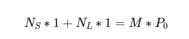
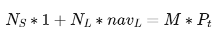
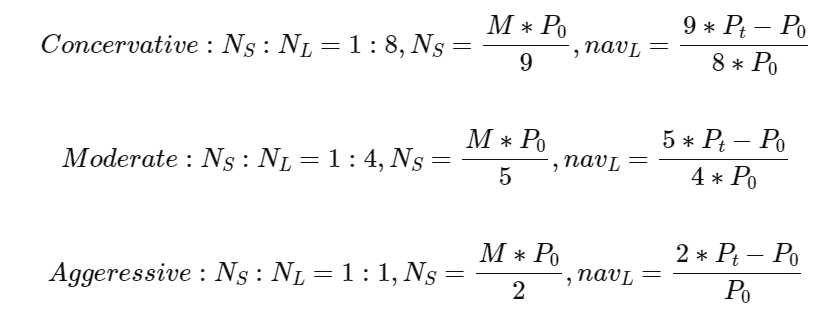

# BSM Project — LTC-backed Leveraged Stablecoin System

This repository contains a Hardhat + TypeScript project implementing an LTC-backed leveraged stablecoin system. It includes Solidity contracts (core engine, AMM, auctions/liquidations, interest manager), scripts for deployment and interaction, unit tests, and a Vue 3 frontend.

Inspired by the concept of structure funds, we split a virtual currency(e.g., LTC)into two components: a **Stable Token (S)** and a **Leverage Token (L)**.
- The **Stable Token (S)** always maintains a value of 1. Holders can use it in relevant application scenarios or stake it in our AMM pool to earn returns.
- The **Leverage Token (L)** captures the gains of the underlying asset, bears its risks, and pays interest fees to the system.

Within our protocol, the Stable Token is implemented as a standard **ERC‑20** token. To enable different leverage attributes, the Leverage Token contract extends the **ERC‑1155** standard.

During the minting process, users must specify two parameters:
1. **Leverage Type** — options are _Conservative_, _Moderate_, and _Aggressive_. These correspond to S:L minting ratios of **1:8**, **1:4**, and **1:1**, respectively.    
2. **Mint Price** — the price of the underlying asset at which the user chooses to mint.


If a user supplies an amount $M$ of the underlying asset and selects a minting price $P_0$, the corresponding formula is:

Initially, 

When underlying price changes to Pt, 

For the three different leverage types, we obtain, 

In addition to the core tokenization mechanism, our protocol introduces an Automated Market Maker (AMM) pool to facilitate liquidity and user interaction. The primary functions of this AMM are twofold: (i) enabling efficient exchange between the Stable Token (S) and USDC, and (ii) supporting exchange between the Leverage Token (L) and USDC. Structurally, the AMM pool is composed of Stable Tokens and USDC, and its pricing curve adheres to the stable swap invariant. This design ensures low-slippage trading for assets of similar value and enhances capital efficiency. The implementation draws upon the principles established in Michael Egorov’s seminal work, StableSwap – Efficient Mechanism for Stablecoin Liquidity, which provides the theoretical foundation for stablecoin-focused AMM architectures. By integrating this invariant into our system, we aim to deliver a robust and scalable liquidity layer that supports both stability and leverage within the ecosystem.

To preserve the stability of the **S token**, the system initiates a liquidation auction of the underlying assets once the net asset value (NAV) of the **L token** falls below a predefined threshold during a sustained decline in the reference asset. Under the auction mechanism specified by the protocol, any participant may bid for the underlying assets at a price lower than the prevailing market value. Bidders pay in S tokens and receive a portion of the underlying assets; meanwhile, the system retains part of the proceeds as a penalty reserve fund for risk management, while the remainder is returned to the liquidated party. Throughout this process, the liquidated party inevitably incurs partial losses due to liquidation.

In the second iteration of this project, we introduce a **downward adjustment mechanism** designed to mitigate liquidation risk before the L token NAV reaches the threshold. Specifically, users may choose either:
1. To increase the quantity of underlying assets, or
2. To reduce the number of L tokens in circulation.
Through either operation, the NAV of the L token is forcibly reset to 1, thereby restoring stability and preventing liquidation.


---

## Table of contents
- Quick start
- Contracts (brief)
- Scripts
- Testing
- Frontend
- Deployment & verification
- CI recommendations
- Security & push checklist
- Contributing
- License

---

## Quick start (developer)

Prerequisites
- Node.js >= 18
- npm or pnpm
- PowerShell (Windows) — scripts provided for Windows

Install

```pwsh
cd "c:\Files\QPRLib_HK\Defi Project\BSM Project"
npm ci
```

Typecheck

```pwsh
npx tsc --noEmit
```

Run tests

```pwsh
npx hardhat test
# Run a single test file:
npx hardhat test test/CustodianFixed.test.ts
```

Run frontend (optional)

```pwsh
cd frontend
npm ci
npm run dev
```

---

## Contracts

- `CustodianFixed.sol` — Core coordinator. Central protocol contract that holds underlying collateral, mints/burns StableToken and MultiLeverageToken (via calls to the token contracts), and coordinates interest, liquidation, and auction flows. It is the authority that the frontend and AMM interact with to create S/L positions.

mint : User supplies underlying token (WLTC) to mint S (StableToken) and L (Leverage token) according to a target mint price and leverage level.

burnFromUser : User burns a percentage of a given L token ID to redeem underlying and cause S to be burned.

- `StableToken.sol` — StableToken.sol is a simple ERC-20 token contract representing the protocol's stable token (symbol S). It provides minting and burning functionality restricted to a designated custodian contract and includes owner controls to set that custodian.

- `MultiLeverageToken.sol` — MultiLeverageToken.sol is an ERC1155-based contract that implements the protocol’s leverage tokens (L tokens). It supports two kinds of tokens: pre-defined static tokens (IDs 1–9) and on-demand dynamic tokens (IDs ≥ 10). The contract stores metadata, value/mint-price for each token, and restricts mint/burn to a protocol custodian contract.

- `AMMSwap.sol` — Implements swap logic and the higher-level flows between StableToken, USDC, underlying (WLTC), and leverage tokens. Integrates a StableSwap-like pool for Stable/USDC and uses Uniswap V3 (UniversalRouter + QuoterV2) for underlying <> USDC trades when buying/selling leverage tokens. Also orchestrates mint/burn via `CustodianFixed`.

- `AMMLiquidity.sol` — On-chain liquidity pool and `LPToken` management; exposes pool swap primitives used by `AMMSwap`.
- `InterestManager.sol` — Tracks accrued interest per L position and supports interest collection/withdrawal.
- `LiquidationManager.sol` / `AuctionManager.sol` — Liquidation lifecycle and Dutch-style auctions for collateral.

For details, read the contracts in `contracts/` and the per-contract summaries in the docs folder.

---

## Scripts

Scripts are in `scripts/` and include examples for minting mocks, interacting with the AMM, running auctions, and verifying contracts. Examples:

- `scripts/1_mint_USDCWLTCtokens_viem.ts` — mint mock tokens for tests
- `scripts/2_mint_SLtokens_viem.ts` — mint S and L tokens for basic scenarios
- `scripts/3_verify_allContracts_viem.ts` — Etherscan verification helper
- `scripts/4_interact_amm_viem.ts` — end-to-end AMM interaction example
- `scripts/5_auction_viem.ts` — auction flow example

Read headers of each script for usage details and required environment variables.

---

## Testing

- Unit tests are in `test/` (Hardhat + viem style). Use `npx hardhat test`.
- Mocks provided: `QuoterV2Mock`, `UniversalRouterMock`, `WLTCMock`, `USDCMock` — use them for deterministic DEX behavior.
- Recommended tests to run before push: all unit tests, and targeted integration tests for AMM/auction flows.

---

## Frontend

- Vue 3 + Vite project lives in `frontend/`.
- Key helper: `frontend/src/utils/contracts.ts` centralizes ABI loading and read/write contract factories.
- Build and run via Vite during development: `cd frontend && npm run dev`.

---

## Deployment & verification

- Use Hardhat ignition scripts (in `ignition/`) or the `scripts/` helpers to deploy modules.
- Example (local/sepolia flow):

```pwsh
npx hardhat ignition deploy ignition/modules/tokenModules.ts --network sepolia
npx hardhat ignition deploy ignition/modules/coreModules.ts --network sepolia
# then amm modules
npx hardhat ignition deploy ignition/modules/ammModules.ts --network sepolia
```

- Verify contracts with `npx hardhat verify` or `scripts/3_verify_allContracts_viem.ts`.

---

## Continuous integration (recommended)

- Run on PRs: `npm ci`, `npx tsc --noEmit`, `npx hardhat test`.
- Keep secrets (RPC keys, private keys) in GitHub Secrets. Do not commit `.env` files.
- Example workflow: run typecheck + unit tests on push/PR; run E2E in a protected branch or separate job.

---

## Security & push checklist

Before pushing to remote (public GitHub):

1. Remove secrets and large artifacts:
   - `git rm --cached path/to/secret`
   - Ensure `.gitignore` contains `.env*`, `ignition/deployments/`, `artifacts/`, `node_modules/`, `*.pptx`.
2. Run tests and typecheck locally:
   - `npx tsc --noEmit` and `npx hardhat test`
3. Scan for secrets with a tool (git-secrets, truffleHog) or the provided `create_and_push.ps1` script.
4. Create a meaningful commit and PR with description and CI results.

Security notes:
- Do not store private keys or mnemonic phrases in the repo.
- Use role-based access in contracts (ADMIN_ROLE, AUCTION_ROLE, etc.) and restrict privileged calls in production.

---

## Contributing

- Please open issues and PRs. Include unit tests for any contract logic changes.
- Code style: TypeScript + Prettier for frontend/scripts; prefer small, focused commits.

---

## License

This project does not include a license file by default. Add a `LICENSE` file (e.g., MIT) if you intend to open-source this repository.

---

## Contacts / Maintainers

- Add project maintainers, primary contacts, and security disclosure contact here.

---

## Known issues & roadmap

- AMMSwap buy-flow requires careful ordering: ensure USDC/S balances are present on-contract before calling `UniversalRouter`. See `AMMSwap` TODOs and unit tests.
- Tests: `test/CustodianFixed.test.ts` exists but may require iteration to pass in some environments; run unit tests and open issues for failing cases.

---

If you want I can commit this `README.md` for you and optionally add a CI workflow and `CONTRIBUTING.md`/`SECURITY.md` files. 

