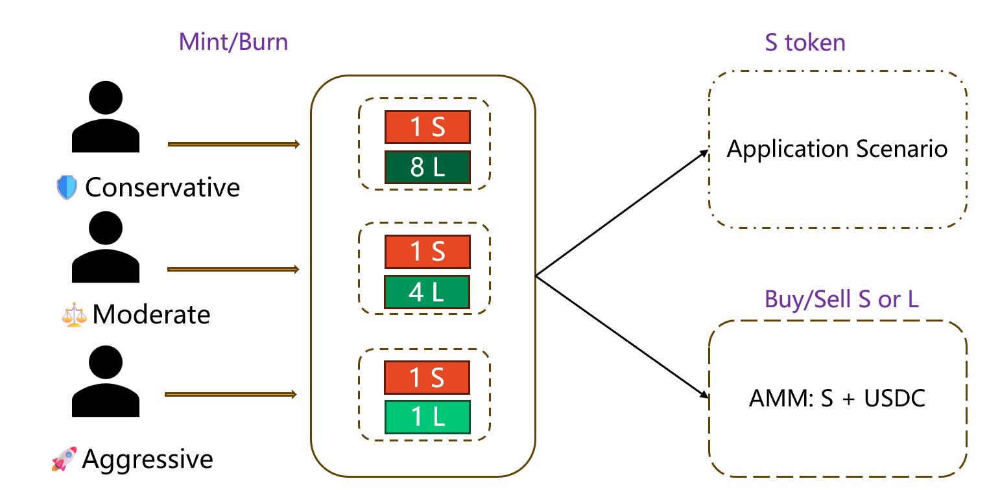

# BSM Project

This repository contains a Hardhat + TypeScript project implementing an LTC-backed leveraged stablecoin system. It includes Solidity contracts (core engine, AMM, auctions/liquidations, interest manager), scripts for deployment and interaction, unit tests, and a Vue 3 frontend.

Inspired by the concept of structure funds, we split a virtual currency(e.g., LTC)into two components: a **Stable Token (S)** and a **Leverage Token (L)**.
- The **Stable Token (S)** always maintains a value of 1. Holders can use it in relevant application scenarios or stake it in our AMM pool to earn returns.
- The **Leverage Token (L)** captures the gains of the underlying asset, bears its risks, and pays interest fees to the system.

Within our protocol, the Stable Token is implemented as a standard **ERC‑20** token. To enable different leverage attributes, the Leverage Token contract extends the **ERC‑1155** standard.

During the minting process, users must specify two parameters:
1. **Leverage Type** — options are _Conservative_, _Moderate_, and _Aggressive_. These correspond to S:L minting ratios of **1:8**, **1:4**, and **1:1**, respectively.    
2. **Mint Price** — the price of the underlying asset at which the user chooses to mint.



If a user supplies an amount $M$ of the underlying asset and selects a minting price $P_0$, the corresponding formula is:

Initially, 


When underlying price changes to Pt, 


For the three different leverage types, we obtain,


In addition to the core tokenization mechanism, our protocol introduces an Automated Market Maker (AMM) pool to facilitate liquidity and user interaction. The primary functions of this AMM are twofold: (i) enabling efficient exchange between the Stable Token (S) and USDC, and (ii) supporting exchange between the Leverage Token (L) and USDC. Structurally, the AMM pool is composed of Stable Tokens and USDC, and its pricing curve adheres to the stable swap invariant. This design ensures low-slippage trading for assets of similar value and enhances capital efficiency. The implementation draws upon the principles established in Michael Egorov’s seminal work, StableSwap – Efficient Mechanism for Stablecoin Liquidity, which provides the theoretical foundation for stablecoin-focused AMM architectures. By integrating this invariant into our system, we aim to deliver a robust and scalable liquidity layer that supports both stability and leverage within the ecosystem.

To preserve the stability of the **S token**, the system initiates a liquidation auction of the underlying assets once the net asset value (NAV) of the **L token** falls below a predefined threshold during a sustained decline in the reference asset. Under the auction mechanism specified by the protocol, any participant may bid for the underlying assets at a price lower than the prevailing market value. Bidders pay in S tokens and receive a portion of the underlying assets; meanwhile, the system retains part of the proceeds as a penalty reserve fund for risk management, while the remainder is returned to the liquidated party. Throughout this process, the liquidated party inevitably incurs partial losses due to liquidation.

In the second iteration of this project, we introduce a **downward adjustment mechanism** designed to mitigate liquidation risk before the L token NAV reaches the threshold. Specifically, users may choose either:
1. To increase the quantity of underlying assets, or
2. To reduce the number of L tokens in circulation.
Through either operation, the NAV of the L token is forcibly reset to 1, thereby restoring stability and preventing liquidation.


---

## Table of contents
- Quick start
- Contracts(brief)
   - CustodianFixed.sol
   - StableToken.sol
   - MultiLeverageToken.sol
   - AMMSwap.sol
   - AMMLiquidity.sol
   - InterestManager.sol
   - LTCPriceOracle.sol
   - LiquidationManager.sol
   - AuctionManager.sol
- Scripts
- Testing
- Frontend
- Deployment & verification
- CI recommendations
- Security & push checklist
- Contributing
- License

---

## Quick start (developer)

Prerequisites
- Node.js >= 18
- npm or pnpm
- PowerShell (Windows) — scripts provided for Windows

Install

```pwsh
cd "c:\Files\QPRLib_HK\Defi Project\BSM Project"
npm ci
```

Typecheck

```pwsh
npx tsc --noEmit
```

Run tests

```pwsh
npx hardhat test
# Run a single test file:
npx hardhat test test/CustodianFixed.test.ts
```

Run frontend (optional)

```pwsh
cd frontend
npm ci
npm run dev
```

---

## Contracts

- `CustodianFixed.sol` — Core coordinator. Central protocol contract that holds underlying collateral, mints/burns StableToken and MultiLeverageToken (via calls to the token contracts), and coordinates interest, liquidation, and auction flows. It is the authority that the frontend and AMM interact with to create S/L positions.


   _`mint`_ : User supplies underlying token (WLTC) to mint S (StableToken) and L (Leverage token) according to a target mint price and leverage level.

   _`burnFromUser`_ : User burns a percentage of a given L token ID to redeem underlying and cause S to be burned.

   _`mintFromAMM`_ : When one user uses USDC to buy L token, AMM pool calls this function to mint L tokens.

   _`burnFromAMM`_ : Intended for AMM-driven burns/sells, this function burns a percentage of an L token on behalf of a position and redeems the underlying; the AMM supplies S to the custodian. It validates price freshness, computes burn preview via previewBurn, ensures balances/allowances and contract underlying balance, then burns S and L, updates interest and accounting, transfers redeemed underlying (to caller/AMM) and interest portion to InterestManager, and emits a Burn event. It requires onlyAuthorizedAMM and nonReentrant.

   _`_executeMintCore`_ : Internal function that performs the core state changes for minting: it records collateral and per-user collateral mapping, mints S tokens, mints the chosen static or dynamic L tokens, records the position in InterestManager, updates total supplies, and records the token ID in the user's token list if it's new. This function centralizes side effects so higher-level mint entry points share consistent bookkeeping.

   _`getAllLeverageTokenInfo`_ : Collects and returns arrays of token IDs, balances, leverage types, mint prices, and accrued interests for every non-zero L token the user holds. The function filters the user’s stored token IDs for active balances and returns compact arrays suitable for UI display. It allows the frontend to derive per-position NAV and interest info.

   _`getSingleLeverageTokenInfo`_ : Returns detailed metadata for a specific token the user holds, including balance, leverage type, mint price, name, static flag, accrued interest and creation time. It requires the user to actually own the token (balance > 0) and delegates token info and interest reads to the corresponding contracts. This supports single-position views in the UI.

   _`getSingleLeverageTokenNavV2`_ : Computes the NAV metrics for one leverage token using the internal oracle: it validates the user balance, fetches the latest oracle price, calculates Gross NAV via CustodianUtils.calculateNav, applies accrued interest to produce net NAV and total net values, and returns price and timestamp. This function provides a single-call on-chain source of truth for frontends and other contracts that need consistent NAV calculations.

- `StableToken.sol` — StableToken.sol is a simple ERC-20 token contract representing the protocol's stable token (symbol S). It provides minting and burning functionality restricted to a designated custodian contract and includes owner controls to set that custodian.

   _`mint`_ : Allows the configured custodian contract to mint amount tokens to the specified to address; it enforces non-zero recipient and positive amount. After minting it calls OpenZeppelin _mint and emits a Minted event for transparency.

   _`burn`_ : Lets the custodian burn amount tokens from the from address, ensuring the address and amount are valid and that from has sufficient balance. It calls OpenZeppelin _burn and emits a Burned event to record the action.

   _`setCustodian`_ : Owner-only function that sets the custodian address used to perform privileged mint and burn operations. It validates the address is non-zero, updates state, and emits CustodianChanged with the old and new custodian addresses.

- `MultiLeverageToken.sol` — MultiLeverageToken.sol is an ERC1155-based contract that implements the protocol’s leverage tokens (L tokens). It supports two kinds of tokens: pre-defined static tokens (IDs 1–9) and on-demand dynamic tokens (IDs ≥ 10). The contract stores metadata, value/mint-price for each token, and restricts mint/burn to a protocol custodian contract.

   _`mintStaticToken`_ : Custodian-only function that mints a specified amount of a static token to to; it verifies the token ID is within the static range and exists, then calls _mint and emits TokensMinted. Use this when creating supply for predefined static positions.

   _`mintDynamicToken`_ :  Custodian-only minting for dynamic tokens (IDs >= 10); it validates the token exists and is dynamic, then mints the amount and emits TokensMinted. This separates dynamic issuance from static issuance logic.

- `AMMSwap.sol` — Implements swap logic and the higher-level flows between StableToken, USDC, underlying (WLTC), and leverage tokens. Integrates a StableSwap-like pool for Stable/USDC and uses Uniswap V3 (UniversalRouter + QuoterV2) for underlying <> USDC trades when buying/selling leverage tokens. Also orchestrates mint/burn via `CustodianFixed`.

   _`swapStableToUsdc`_ : User-facing swap that sells StableToken for USDC using the AMM pool: it calls the view preview, validates balances/allowances and AMM reserves, executes the transfer through AMMLiquidity, accumulates admin/LP fees, triggers auto-withdraw when threshold reached, and emits events. It enforces non-reentrancy and multiple sanity checks so the swap conforms to the StableSwap pricing model.

   _`swapUsdcToStable`_ : User-facing swap that sells USDC for StableToken: it calls the preview, verifies user allowances and AMM pool balances, instructs AMMLiquidity to perform the token transfers, accumulates admin/LP fees, optionally auto-withdraws, and emits events. It uses the StableSwap pricing simulation to ensure the pool can satisfy the requested output.

   _`swapLeverageToUsdc`_ : High-level flow for selling leverage tokens to USDC: it previews the burn to learn required S tokens, checks pool reserves, calls custodian.burnFromAMM to merge/burn S+L and redeem underlying, sells the underlying on a DEX for USDC, pays the AMM and user shares, syncs AMM reserves, handles fees, and emits events. The function centralizes many moving parts (custodian burn, StableSwap math, DEX sale) and includes defensive checks around oracle price and balance consistency.

   _`swapUsdcToLeverage`_ : End-to-end flow to buy leverage tokens with USDC: it computes required underlying and Stable amounts for the requested L tokens, gets a DEX quote, pulls USDC from the user, buys underlying on DEX, approves and calls custodian.mintFromAMM to mint S+L (S goes to the swap contract), sells the minted S back to the AMM for USDC, refunds the user any excess, updates AMM reserves, handles fees, and emits events. The function coordinates user funds, DEX execution, and on-chain minting to produce L tokens while attempting to keep the AMM balanced.

- `AMMLiquidity.sol` — On-chain liquidity pool and `LPToken` management; exposes pool swap primitives used by `AMMSwap`.

   _`addLiquidityStable`_ : User-facing function to add liquidity by supplying Stable; it calls the preview, checks token balances and allowances, transfers both tokens from the user into the pool, updates reserves, and mints LP tokens to the provider (with a small minimum-liquidity lock on initial deposit). It emits LiquidityAdded and returns the minted LP amount and actual token amounts used.

   _`addLiquidityUSDC`_ : User-facing function to add liquidity by supplying USDC; it mirrors addLiquidityStable by computing the required Stable, validating balances/allowances, transferring tokens, updating reserves, minting LP tokens, emitting LiquidityAdded, and returning the results to the caller.

   _`removeLiquidity`_ : Allows a liquidity provider to burn LP tokens to withdraw their pro-rata share of Stable and USDC reserves. It validates LP balance and total supply, computes withdrawal amounts by ratio, burns LP tokens, updates reserves, transfers underlying tokens back to the user, and emits LiquidityRemoved.

   _`swapStableToUsdc`_ : Swap-authorized function that executes a Stable→USDC swap: it pulls stableAmountIn from the user, sends usdcAmountOut to the user, updates reserves accordingly, and emits SwapExecuted. It expects AMMSwap to perform price/fee calculations off-chain or in its own logic and ensures sufficient USDC reserve.

   _`swapUsdcToStable`_ : Swap-authorized function for USDC→Stable swaps: it transfers USDC in from the user, sends Stable out to the user, updates the reserves, and emits SwapExecuted, while validating sufficient Stable reserve exists.

- `InterestManager.sol` — Tracks accrued interest per L position and supports interest collection/withdrawal.

   _`recordPosition`_ : Called by the custodian when a user mints or increases a leverage position; it either creates a new UserPosition or increases an existing one, updating timestamps and accrued interest. The function also updates global counters (active positions, total leverage) and emits events for UI and auditing.

   _`updateUserPosition`_ : Custodian-only function invoked during merges/burns to deduct paid interest and reduce the user's L token amount; it clamps the deducted interest to the accrued amount, updates totals and active flags, and increments totalInterestCollected. It centralizes state changes when users pay interest and positions shrink or close.

   _`totalAccruedInterest`_ : Custodian-only view+update helper that computes interest accrued since the position's last timestamp, updates the stored accrued interest and global totalInterestAccrued, and returns the user's current accrued interest. It allows the custodian to pull up-to-date interest before merging/burning operations.

   _`_calculateAccruedInterest`_ : Internal math helper that computes simple time-proportional interest: principal × annualRate × (holdingTime / secondsPerYear), then adjusts by leverage type (e.g., divide by 8 or 4 for conservative/moderate). It returns interest in wei and is reused by preview and update functions.

- `LTCPriceOracle.sol` - LTCPriceOracle is a compact on-chain price feed compatible with the Chainlink V3 interface: it stores historical rounds, supports authorized feeders, and exposes both standard Chainlink view functions and convenience helpers.
It enforces sane bounds and staleness checks, supports emergency mode with a fixed fallback price, and emits events for price updates and feeder management.

   _`latestRoundData`_ : Chainlink-compatible view that returns the latest round’s data (id, price, timestamps). It returns the emergency price when emergency mode is active and otherwise enforces that the cached price is valid and not too old.

   _`updatePrice`_ : Called by authorized price feeders to publish a new price; it validates bounds and large price changes (emitting InvalidPriceSubmitted or requiring owner approval for big jumps), advances the round ID, stores the round, and emits PriceUpdated. It intentionally records suspicious large changes for operator review rather than silently accepting them.

- `LiquidationManager.sol` — LiquidationManager monitors user leverage positions, computes net asset values (NAV), and triggers liquidations when positions fall below configured thresholds. It coordinates with CustodianFixed to burn leverage tokens and with AuctionManager to create Dutch auctions for reclaimed collateral, while tracking per-user liquidation status and risk levels.

   _`bark`_ : The liquidation trigger (analogous to MakerDAO’s bark) — it verifies a user’s NAV is below the liquidation threshold, calculates the value to burn, destroys the leverage token via custodian.burnToken, updates user status to frozen, and starts an auction by calling AuctionManager.startAuction. It encapsulates the full liquidation flow from detection to auction creation and keeper reward assignment.


- `AuctionManager.sol` — AuctionManager coordinates liquidation auctions: it receives triggers (typically from the liquidation manager), computes starting and current prices using the oracle and a linear decrease price calculator, and records auction metadata and keeper rewards. Buyers purchase underlying by paying StableToken; the contract enforces minimum purchase amounts, validates approvals, updates auction accounting, transfers underlying via the Custodian, and settles completed auctions with the LiquidationManager.

   _`startAuction`_ : Triggered by a caller with CALLER_ROLE to create a new auction record: it computes the starting price using the oracle, calculates keeper rewards, records auction metadata, sends residuals to the original owner, and pays the keeper reward via the CustodianFixed contract. It increments counters and marks the auction active.

   _`resetAuction`_ : Resets an auction’s timer and starting price when price/time conditions are met; it recomputes the starting price via the oracle, recalculates keeper reward, deducts reward from the auction’s underlying accounting, and issues the reward to the triggerer. This keeps auctions progressing if they are not fully filled.

   _`purchaseUnderlying`_ : Allows a buyer to purchase a slice of the auctioned underlying asset by supplying StableToken. It validates price and minimum purchase constraints, computes payment amounts, updates auction state (remaining burn value and sold underlying), transfers underlying to the buyer via CustodianFixed, makes an external callback if requested, and collects stable payment from the buyer through custodian.receiveFromKpr.


For details, read the contracts in `contracts/` .

---

## Scripts

Scripts are in `scripts/` and include examples for minting mocks, interacting with the AMM, running auctions, and verifying contracts. Examples:

- `scripts/1_mint_USDCWLTCtokens_viem.ts` — mint mock tokens for tests
- `scripts/2_mint_SLtokens_viem.ts` — mint S and L tokens for basic scenarios
- `scripts/3_verify_allContracts_viem.ts` — Etherscan verification helper
- `scripts/4_interact_amm_viem.ts` — end-to-end AMM interaction example
- `scripts/5_auction_viem.ts` — auction flow example

Read headers of each script for usage details and required environment variables.

---

## Testing

- Unit tests are in `test/` (Hardhat + viem style). Use `npx hardhat test`.
- Mocks provided: `QuoterV2Mock`, `UniversalRouterMock`, `WLTCMock`, `USDCMock` — use them for deterministic DEX behavior.
- Recommended tests to run before push: all unit tests, and targeted integration tests for AMM/auction flows.

---

## Frontend

- Vue 3 + Vite project lives in `frontend/`.
- Key helper: `frontend/src/utils/contracts.ts` centralizes ABI loading and read/write contract factories.
- Build and run via Vite during development: `cd frontend && npm run dev`.

---

## Deployment & verification

- Use Hardhat ignition scripts (in `ignition/`) or the `scripts/` helpers to deploy modules.
- Example (local/sepolia flow):

```pwsh
npx hardhat ignition deploy ignition/modules/tokenModules.ts --network sepolia
npx hardhat ignition deploy ignition/modules/coreModules.ts --network sepolia
# then amm modules
npx hardhat ignition deploy ignition/modules/ammModules.ts --network sepolia
```

- Verify contracts with `npx hardhat verify` or `scripts/3_verify_allContracts_viem.ts`.

---

## Continuous integration (recommended)

- Run on PRs: `npm ci`, `npx tsc --noEmit`, `npx hardhat test`.
- Keep secrets (RPC keys, private keys) in GitHub Secrets. Do not commit `.env` files.
- Example workflow: run typecheck + unit tests on push/PR; run E2E in a protected branch or separate job.

---

## Security & push checklist

Before pushing to remote (public GitHub):

1. Remove secrets and large artifacts:
   - `git rm --cached path/to/secret`
   - Ensure `.gitignore` contains `.env*`, `ignition/deployments/`, `artifacts/`, `node_modules/`, `*.pptx`.
2. Run tests and typecheck locally:
   - `npx tsc --noEmit` and `npx hardhat test`
3. Scan for secrets with a tool (git-secrets, truffleHog) or the provided `create_and_push.ps1` script.
4. Create a meaningful commit and PR with description and CI results.

Security notes:
- Do not store private keys or mnemonic phrases in the repo.
- Use role-based access in contracts (ADMIN_ROLE, AUCTION_ROLE, etc.) and restrict privileged calls in production.

---

## Contributing

- Please open issues and PRs. Include unit tests for any contract logic changes.
- Code style: TypeScript + Prettier for frontend/scripts; prefer small, focused commits.

---

## License

This project does not include a license file by default. Add a `LICENSE` file (e.g., MIT) if you intend to open-source this repository.

---

## Contacts / Maintainers

- Add project maintainers, primary contacts, and security disclosure contact here.

---

## Known issues & roadmap

- AMMSwap buy-flow requires careful ordering: ensure USDC/S balances are present on-contract before calling `UniversalRouter`. See `AMMSwap` TODOs and unit tests.
- Tests: `test/CustodianFixed.test.ts` exists but may require iteration to pass in some environments; run unit tests and open issues for failing cases.

---

If you want I can commit this `README.md` for you and optionally add a CI workflow and `CONTRIBUTING.md`/`SECURITY.md` files. 

